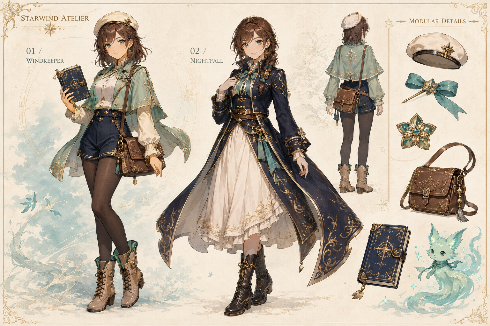

# 星風旅人：角色與混搭設計候選 v1

2026-09-06。使用者否決幾何拼裝 3D 原型之後製作；目前為角色美術候選稿，尚未成為實機人物。

生成方式：內建 image_gen 工具，用於視覺方向預覽。不是現成遊戲角色，也不是從已有模型截取。

本稿檢查：自然精緻臉部、連續髮束、衣料層次、同一人物身分、日常與進階服裝的收藏差異。左為薄荷旅裝，右為晚星長外套。配件包含貝雷帽、髮帶、胸針、皮包、手帳與精靈。

限制：這是一張扁平設計稿，沒有透明分層、骨架、可執行動畫或獨立 3D 服裝網格。圖中的風格與配件不能被宣稱已製作完成或放進商店。下一步先依使用者回饋確認比例與細節密度，再製作同尺度正背側母版、分槽資產與共用動作。

## Generation prompt

Create a polished original Japanese fantasy game CHARACTER DESIGN BOARD for a collectible cozy budgeting adventure, not a website mockup. This must have the appeal and quality of a professional anime RPG character concept, with fine art-directed facial features, beautiful continuous hair strands, convincing tailored clothes and charming collectible details. Landscape 3:2 composition, refined warm ivory paper background with very subtle teal watercolor wash and delicate golden technical lines. Two LARGE full-body illustrations occupy the left 70%: EXACT SAME young adult female traveler, natural 5.5-head-tall anime proportions, slender graceful silhouette, warm hazel/teal expressive ALMOND eyes, softly shaped face, small natural nose and mouth, chestnut shoulder-length layered hair with side-swept wispy bangs. Face should be elegant and friendly, not a toddler, doll, mascot, toy, or big googly eyes. LEFT illustration: signature mint-green tailored cropped adventure jacket with soft short split cape, ivory blouse and refined collar, small gold floral brooch, navy high-waisted shorts over opaque dark stockings, beautifully constructed tan lace-up ankle boots, fine brown leather satchel, small cream beret with an understated star-shaped metal pin. Relaxed confident three-quarter stance holding an ornate navy pocket journal. SECOND illustration: same identity, different truly collectible outfit: midnight-indigo fitted long traveling coat with ivory lining, gold embroidery and layered coat tails, restrained teal ribbon and structured belt, cream knee-length skirt, dark lace-up boots; hair styled in a lovely low side braid with teal ribbon, no beret. Same anatomy and face as left. The right 30% is a small beautifully composed equipment design area: detached cream beret, teal ribbon hairpin, tiny five-petal gold-and-teal brooch, leather satchel, ornate journal, and one small glowing mint spirit companion, each clearly separated. Add a small precise back-view drawing of the signature cape outfit above the equipment. Maintain consistent character proportions, rendering and palette across the entire board. Hand-painted anime game concept art with clean expressive linework, refined cel-shaded forms, soft material highlights, subtle cloth folds, embroidered hems, hair translucency. Use bright directional warm daylight, lovely warm/cool shadow color, luminous but restrained detail. The characters should look like appealing collectible protagonists of a high-quality indie fantasy game. Only sparse tiny English design labels: 'STARWIND ATELIER', '01 / WINDKEEPER', '02 / NIGHTFALL', 'MODULAR DETAILS'. No UI cards, no money, no charts, no mobile frame, no ugly blocky 3D, no plastic/clay render, no floating cylindrical limbs, no geometric hair chunks, no giant round eyeballs, no generic AI princess gown, no copying existing game characters or logos. All boots, hair and accessories fully inside frame with comfortable margins.
